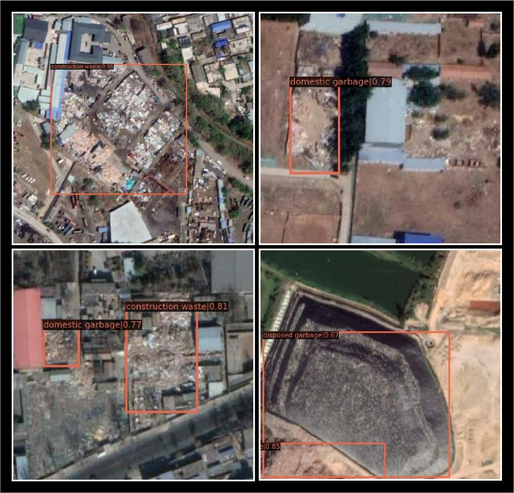

## Introduction

This is a project for garbage dump detection with BCA-Net, which can be used to perform global garbage dump 
detection with our upcoming multi-category garbage dump 
dataset.



## Prerequisites

- OS: Ubuntu 16.04
- GPU: Nvidia GTX/RTX series GPU with proper [NVIDIA Driver](https://www.nvidia.com/Download/index.aspx?lang=en-us) installed
- Software: [Docker](https://www.docker.com/) installed

## Installation
  
1. Create a new project folder.
    ```shell
    mkdir /home/$[YOUR_USERNAME]/garbage_dump
    cd /home/$[YOUR_USERNAME]/garbage_dump
    ```
2. Download the code.
    ```shell
    git clone https://github.com/DongshuoYin/garbage_dump_detection.git
    ```
3. Download dataset in our paper's link. 

4. Unzip the dataset to `./garbage_dump_detection/data/`.
    ```none 
    garbage_dump_detection
    ├── mmdet
    ├── tools
    ├── configs
    ├── data
    │   ├── garbage_dump_2022
    │   │   ├── VOC2012
    │   │   │   ├──train
    │   │   │   │   ├──Annotations
    │   │   │   │   ├──JPEGImages
    │   │   │   │   ├──train.txt
    │   │   │   ├──test
    │   │   │   │   ├──Annotations
    │   │   │   │   ├──JPEGImages
    │   │   │   │   ├──test.txt
    ......
    ......
    ```

5. Get the docker image from Docker-hub.
    ```shell
    sudo docker pull y389164605/garbage_dump_detection:latest
    ```
   
6. Create a docker container with the above image.
    ```shell
    sudo nvidia-docker run --privileged=true --name=$[YOUR_CONTAINER_NAME] --shm-size=8g -d -p $[PORT_FOR_CONTAINER_PORT_22]:22 -v /home/$[YOUR_USERNAME]/garbage_dump/garbage_dump_detection:/garbage_dump_detection y389164605/garbage_dump_detection:latest /usr/sbin/sshd -D
    ```
   Note: 
   
    a. If the terminal remains inactive, create a new terminal and continue the operation.
    
    b. `/home/$[YOUR_USERNAME]/garbage_dump/garbage_dump_detection` in your computer and `/garbage_dump_detection` in your docker container are a pair of mapped folders and they will remain consistent.
7. Enter the above docker container.
    ```shell
    sudo docker exec -it $[YOUR_CONTAINER_NAME] /bin/bash
    cd /garbage_dump_detection
    python setup.py develop
    ```
   
## Demo

1. Download the pre-trained model [here](https://drive.google.com/file/d/1qiR5PJvNehQibV1IhjXzOAA7nJrc4fNP/view?usp=sharing) and put it in `/home/$[YOUR_USERNAME]/garbage_dump/garbage_dump_detection/checkpoint_backup/`

2. Run the following code in container.
    ```shell
    cd tools
    python demo.py
    ```

## Batch inference

1. Download the pre-trained model [here](https://drive.google.com/file/d/1qiR5PJvNehQibV1IhjXzOAA7nJrc4fNP/view?usp=sharing) (same as Demo) and put it in `/home/$[YOUR_USERNAME]/garbage_dump/garbage_dump_detection/checkpoint_backup/`.

2. Resize your images to 1024*1024 pixels.

3. Copy all your images to `/home/$[YOUR_USERNAME]/garbage_dump/garbage_dump_detection/tools/batch_inference_data/`.

4. Run the following code in container.
    ```shell
    cd tools
    python inference.py
    ```

5. Check your imference results in `/home/$[YOUR_USERNAME]/garbage_dump/garbage_dump_detection/tools/batch_inference_data/inference_visualization`

## Training the BCA-Net

1. Run the following code.
    ```shell
    cd tools 
    python train.py ../_myconfigs/pascal_voc/faster_rcnn_r50_fpn_1x_voc0712_all_layer_SE_with_ClassBalancedDataset_and_low_nms_score_config_and_data_augumentation.py
    ```
2. Check the evaluation metric on test set after each epoch.

Note: If you want to train with your own dataset, replace the dataset in `/home/$[YOUR_USERNAME]/garbage_dump/garbage_dump_detection/data` with yours and keep the data and folder format the same as ours.
